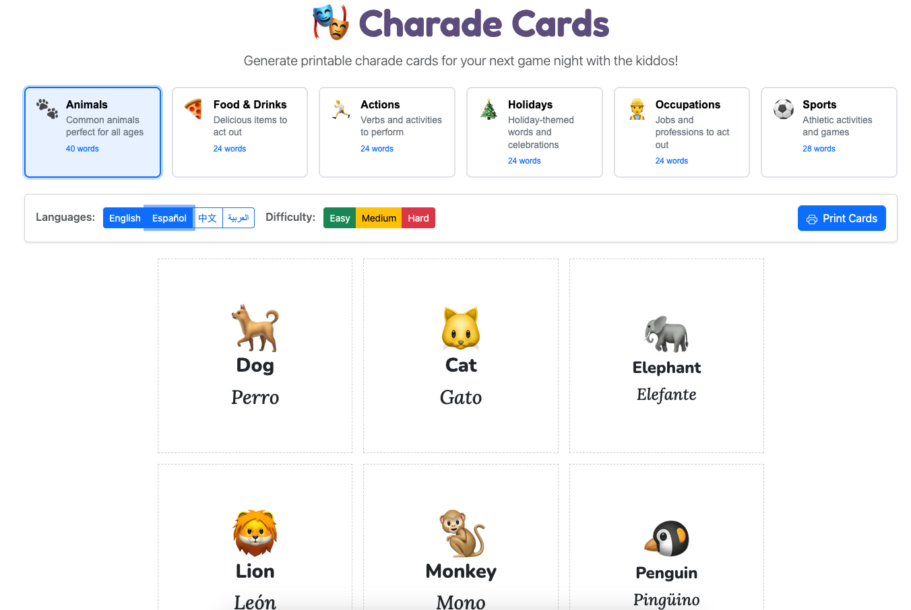

# 🎭 Charade Cards Generator

Generate printable charade cards for your next game night with the kiddos!



## Features

- **6 Themes**: Animals, Food & Drinks, Actions, Holidays, Occupations, Sports
- **4 Languages**: English, Spanish (Español), Chinese (中文), Arabic (العربية)
- **Difficulty Levels**: Easy, Medium, Hard — filter to match your players
- **Print-Ready**: Cards sized for cutting and playing
- **Emoji-Powered**: Visual hints make it fun for all ages

## Usage

1. Select a theme
2. Choose your languages (cards show translations side-by-side)
3. Filter by difficulty if desired
4. Click **Print Cards** and cut along the dashed lines

## Development

This project was built with [SpecKit](https://github.com/pamelafox/speckit) — a spec-driven development approach using AI assistance.

### Tech Stack

- Vanilla HTML5, CSS3, JavaScript (ES2022)
- Bootstrap 5.3 for UI components
- Native Web Components (Shadow DOM)
- Google Fonts (Fredoka, Nunito, Lora, Noto Sans SC, Noto Sans Arabic)
- No build step required

### Run Locally

```bash
# Serve with any static file server
python3 -m http.server 8000

# Or use Node
npx serve
```

Then open http://localhost:8000

### Tests

```bash
npm install
npm test
```

## License

MIT
